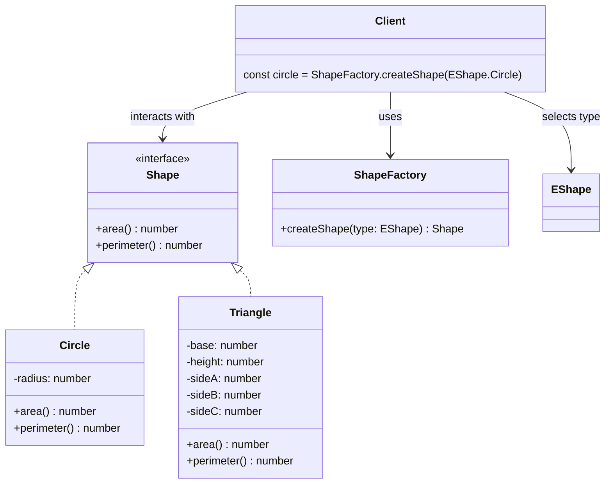

# Factory Design Pattern

provides an interface for creating objects in a superclass, but allows subclasses to alter the type of objects that will be created.

```mermaid
classDiagram

%% Interface
class Shape {
  <<interface>>
  +area() number
  +perimeter() number
}

%% Concrete Classes
class Circle {
  -radius: number
  +area() number
  +perimeter() number
}

class Triangle {
  -base: number
  -height: number
  -sideA: number
  -sideB: number
  -sideC: number
  +area() number
  +perimeter() number
}

%% Factory
class ShapeFactory {
  +createShape(type: EShape) Shape
}

%% Client
class Client {
  const circle = ShapeFactory.createShape(EShape.Circle)
}

%% Relationships
Shape <|.. Circle
Shape <|.. Triangle


Client --> ShapeFactory : uses
Client --> EShape : selects type
Client --> Shape : interacts with
```
